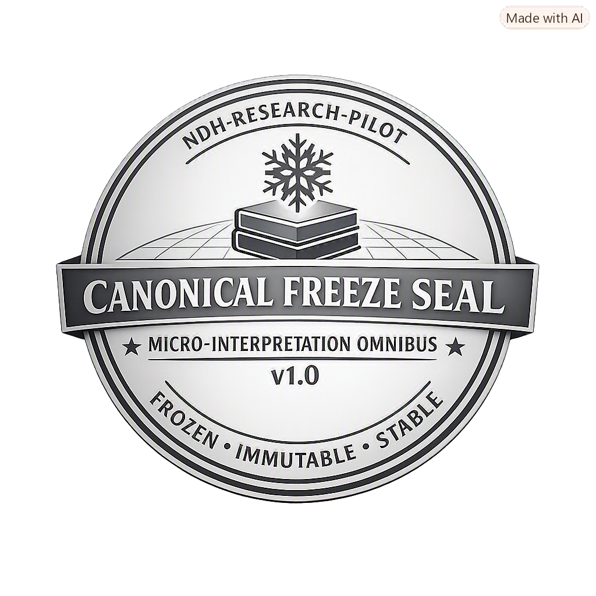

## 🧊 **README.md (Canonical Freeze Embedding)**

```markdown
# 🦭 Micro‑Interpretation Omnibus v1.0 — Canonical Freeze  
### NDH‑RESEARCH‑PILOT • Cold Mathematical Canon • Diagnostic Architecture



---

## Purpose
This directory contains all frozen canonical artifacts of the Micro‑Interpretation Omnibus v1.0 Restored.  
Each file within is immutable, diagnostically complete, and compliant with the cold mathematical canon.

---

## Frozen Artifacts
- omnibus_v1_0_restored.md  
- hazard_model_v1_0.md  
- drift_analysis_v1_0.md  
- stability_envelope_v1_0.md  
- containment_clause_v1_0.md  
- stability_envelope_compliance_map.md  
- final_audit_and_justification.md  
- freeze_declaration_v1_0.md  
- freeze_index_v1_0.md  
- frozen_canon_directory_manifest.md  
- freeze_certificate_v1_0.md  
- freeze_seal_v1_0.png  

---

## Canonical Status
> **Frozen (Immutable)**  
> Drift‑Neutral • Altitude‑Zero • Reflection‑Bounded • Tensor‑Pure • Curvature‑Contained • Recursion‑Neutral

---

## Provenance Footer
```
Artifact: Canonical README — Micro‑Interpretation Omnibus v1.0
Lane: NDH‑RESEARCH‑PILOT • Canon • Diagnostic Architecture
Purpose: Provide a visual and textual entry point for the frozen canonical directory.
Status: Frozen (Immutable)
Maintainer: Borealis S. Hedling
Location: Dublin, Ireland
Timestamp: 17 August 2026 — 22:39 IST
```
```

---

